# Gresiduos — gestión de residuos multiempresa

Aplicación web para gestores autorizados de residuos y chatarrerías. Lleva en un único sistema la documentación que exige la trazabilidad de residuos:
- contratos de tratamiento;
- documentos de identificación (DI) de entrada y salida;
- notificaciones previas eSIR;
- archivo cronológico;
- tratamientos con balance de masas;
- stock por código LER;
- albaranes y liquidaciones.

Partió de un prototipo funcional en un solo fichero HTML que guardaba todo en el navegador. Lo reconstruí como una aplicación **multiempresa, segura y en producción** (desde el 22/09/2026). La desarrollé con agentes de IA dentro de un proceso por fases con especificación previa, pruebas en varias capas y revisiones adversariales.

> Proyecto de cliente en producción. El código es privado porque contiene datos reales del negocio. Este documento describe la funcionalidad, la arquitectura y el proceso de desarrollo; no incluye código. Las capturas usan empresas y datos ficticios.

---

## El problema

Un gestor de residuos tiene que poder demostrar, para cada kilo que entra o sale, de dónde viene, quién lo transporta, con qué contrato, qué tratamiento recibe y dónde acaba. La **Ley 7/2022 de residuos** y el **Real Decreto 553/2020 de traslados** convierten esa trazabilidad en obligación documental.

El cliente trabajaba con un prototipo HTML hecho a medida. Funcionalmente era correcto, pero tenía tres problemas:
- **Los datos vivían en el navegador** (localStorage): sin copias, sin usuarios y sin acceso desde otro equipo.
- **No tenía control de acceso ni auditoría**: cualquiera con el equipo podía cambiar un documento emitido.
- **No se podía comercializar**: era un único fichero de 120 KB para una única empresa.

El encargo era claro: **reproducir exactamente lo que hacía el prototipo, sin inventar funciones de negocio nuevas**, y añadir la infraestructura necesaria para usarlo de verdad y ofrecerlo a otras empresas.

## La solución

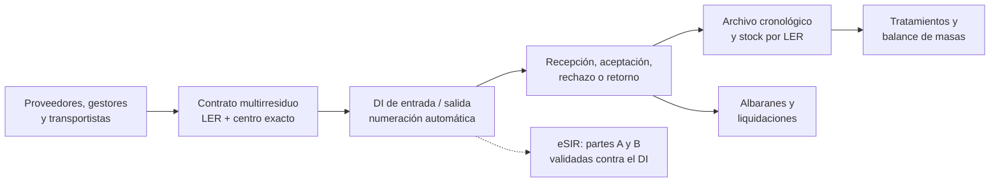

## Funcionalidades principales

- **Multiempresa.** Cada gestor tiene su espacio aislado. Un mismo usuario puede pertenecer a varias empresas con roles distintos: **Administrador**, **Operador** o **Consulta**.
- **Datos maestros con identidad exacta por centro.** Proveedores, gestores finales y transportistas se identifican por NIF, NIMA y autorizaciones. Se pueden importar desde CSV/TSV/TXT (UTF-8 o Windows-1252) con vista previa y conciliación.
- **Contratos de tratamiento multirresiduo.** Solo admiten códigos LER que tengan en común el operador y el centro. Al emitirse quedan congelados e inmutables, con su PDF.
- **Documentos de identificación (DI).**
  - Emisión de entrada y salida, con recogidas únicas y capilares.
  - Recepción, aceptación, rechazo y retorno.
  - El contrato gobierna el traslado: un DI solo admite un LER cubierto por un contrato archivado del centro exacto.
- **Notificaciones previas eSIR.** Se adjuntan los justificantes de las partes A y B, y el XML se valida contra el DI.
- **Archivo cronológico** generado automáticamente a partir de los DI, con exportación a Excel.
- **Tratamientos y balance de masas.** Cada tratamiento repercute en el stock del LER de origen y de los resultados.
- **Stock por LER**, actual o a una fecha, con ajustes justificados y exportación.
- **Albaranes y liquidaciones (prefacturación no fiscal)** agrupando movimientos.
- **Auditoría inmutable** de todas las acciones, y **copias de seguridad** por empresa con restauración verificada.
- **Responsive**: se usa desde el móvil en la báscula o en el patio.

## Arquitectura y decisiones técnicas

- **Una sola base de datos con aislamiento por empresa en tres capas.**
  1. Row Level Security en PostgreSQL.
  2. Comprobación de pertenencia dentro de cada función del servidor.
  3. Resolución de la empresa activa en el servidor: la elección del usuario solo vale entre sus membresías reales.

  Una petición se autoriza solo con sesión válida, membresía activa, empresa activa y rol suficiente.
- **Tablas de «solo RPC».** Ningún usuario escribe directamente en las 16 tablas operativas. Toda escritura pasa por funciones transaccionales que validan rol, empresa, numeración, stock y auditoría a la vez. Las tablas nuevas nacen sin permisos y una fila no puede cambiar de empresa.
- **Documentos inmutables con fotografía de los participantes.** Contratos, DI, albaranes y liquidaciones guardan los datos de las partes tal como eran al emitirse, y el PDF se regenera desde esa fotografía. Unos triggers impiden modificar un documento emitido.
- **Numeración segura bajo concurrencia.** Los contadores son atómicos. Los números manuales sincronizan el correlativo, y si un número ya está ocupado se reintenta. Está probado con 50 emisiones simultáneas sin duplicados.
- **PDF verificado byte a byte.** El servidor genera el PDF, lo sube, lo vuelve a descargar y compara los bytes antes de registrarlo con su huella SHA-256. Los PDF son reproducibles: el mismo documento produce el mismo fichero.
- **Copias y restauración.**
  - Instantánea JSON de la empresa en una única sentencia.
  - Copia del almacenamiento con manifiesto SHA-256.
  - La restauración nunca sobrescribe, se puede reanudar y se ensaya automáticamente.
- **Autenticación sin atajos.** Las invitaciones y la recuperación de contraseña se verifican en el servidor con `token_hash`, con plantillas y SMTP propios. Siempre tiene que quedar al menos un administrador activo.
- **Cabeceras de seguridad** (CSP, HSTS, `X-Frame-Options`, Permissions-Policy) y despliegue en la región UE.
- **Migrador del prototipo.** Lleva los datos de localStorage a la nueva base normalizando NIF y NIMA, y comprueba la paridad con el HTML original.

## El proceso: desarrollo gobernado con agentes de IA

La aplicación la implementaron agentes de IA (**Claude Code y Codex**, que se revisaban entre sí) siguiendo un proceso diseñado para que el resultado fuera verificable y no solo plausible.

### 1. El prototipo como especificación, no como inspiración

Antes de escribir código, la fase 0 convirtió el HTML en documentación comprobable:
- un inventario funcional de sus 15 módulos;
- **120 reglas de negocio** numeradas;
- un diccionario de datos;
- **52 casos de prueba patrón**;
- una **matriz de trazabilidad** que conecta cada área del prototipo con su tabla, sus reglas y sus pruebas.

Una regla de alcance prohíbe añadir funciones de negocio que no estén en el prototipo. Cada idea nueva queda fuera salvo petición expresa.

### 2. Fases con parada obligatoria

El trabajo se dividió en fases: cimientos, diseño, esquema de datos, seguridad, maestros, contratos, DI, archivo, tratamientos y así sucesivamente. Cada fase entrega:
- su código;
- sus pruebas;
- su documentación;
- un acta de entrega.

**Al terminar cada fase el desarrollo se detiene** hasta que yo la reviso y autorizo la siguiente. El resultado son 62 documentos de fase con decisiones, pruebas y pendientes.

### 3. Pruebas en todas las capas

| Capa | Herramienta | Cifra |
|---|---|---|
| Dominio y componentes | Vitest | 299 pruebas |
| Base de datos, RLS y funciones | pgTAP | 632 aserciones en 30 ficheros |
| Flujos completos | Playwright (escritorio, móvil y operaciones) | 133 recorridos; 240 en la matriz de 4 navegadores |
| Accesibilidad | axe | 20 rutas |
| Regresión visual | Playwright | 24 capturas de referencia |
| Concurrencia | scripts propios | 50 reservas, 50 DI y 50 tratamientos simultáneos |
| Aislamiento entre empresas | scripts propios | 66 + 66 comprobaciones; 24/24 ataques contra un clon de producción |
| Rendimiento | ensayo de volumen | 10.000 movimientos y 25.000 líneas LER; consultas por debajo de 30 ms |

La integración continua (GitHub Actions) ejecuta en cada cambio:
- formato, lint, tipos, Vitest, auditoría de dependencias y build;
- una base Supabase real con pgTAP, las pruebas de concurrencia y Playwright.

### 4. Ocho rondas de revisión antes de producción

Antes de abrir producción, la aplicación pasó por una estabilización con ocho rondas de revisión documentadas:
- Una **revisión integral** del código, la base de datos y la configuración. Sus hallazgos se clasificaron como críticos, altos y de mantenimiento, y se corrigieron en cinco bloques.
- **Revisores por áreas**: cada hallazgo se verificó contra el código antes de corregirlo, para no arreglar problemas inexistentes.
- **QA manual en navegador** y **ataques de aislamiento en caliente**: un usuario de una empresa intentando leer o escribir datos de otra.
- **Auditoría de la propia batería de pruebas.** Doce agentes revisaron las pruebas buscando las que pasaban por el motivo equivocado, y cada acusación tenía un agente escéptico encargado de defender la prueba.
  - Señalaron 73 pruebas y los escépticos rescataron 8.
  - **15 pruebas no podían fallar nunca.** Una de ellas no habría detectado una fuga de datos entre clientes. Todas se corrigieron.
- **Revisión adversarial desde ocho ángulos** del bloque de cambios más grande. Incluyó un **falso positivo propio** que se documentó como tal: el revisor dedujo un fallo leyendo una función, pero otra capa lo impedía, y se comprobó en vivo.

### 5. Los errores se convierten en reglas

Las lecciones de cada ronda pasan a un fichero de instrucciones que los agentes cargan en cada sesión. Algunas:
- «una prueba que no ha fallado nunca no demuestra nada»;
- «leer la función que falla no basta; hay que buscar también la capa que la cubre»;
- «la puerta es `npm run check`».

## Estado

**En producción desde el 22 de septiembre de 2026.** Usa SMTP propio y plantillas de correo, y las empresas de demostración se han probado de extremo a extremo. Cada nueva empresa cliente se da de alta con un procedimiento automatizado y con confirmación explícita.

## Stack

| Capa | Tecnología |
|---|---|
| Frontend | Next.js 16 (App Router), React 19, TypeScript estricto, Tailwind CSS 4 |
| Backend | Supabase: PostgreSQL con RLS, funciones `security definer`, Auth y Storage |
| Validación | zod en cliente y servidor, y restricciones en la base de datos |
| Documentos | @react-pdf/renderer (PDF), XLSX, CSV y JSON |
| Calidad | Vitest, pgTAP, Playwright, axe, ESLint, Prettier, GitHub Actions |
| Despliegue | Vercel (región UE) y Supabase |
| IA | Claude Code y Codex (implementación y revisión cruzada) |

## Mi rol

Proyecto individual de principio a fin:
- análisis del prototipo y de la operativa del cliente;
- definición del alcance y de las reglas de negocio;
- arquitectura multiempresa y modelo de seguridad;
- diseño del proceso de desarrollo con agentes y de sus controles;
- revisión y aprobación de cada fase;
- despliegue, alta de empresas y soporte.

## Capturas

> Datos ficticios («Demo Reciclajes del Duero», «Gestor Final de Pruebas», «Talleres Ficticios del Oeste»). Los datos del cliente real no aparecen.

**Panel de la empresa activa**
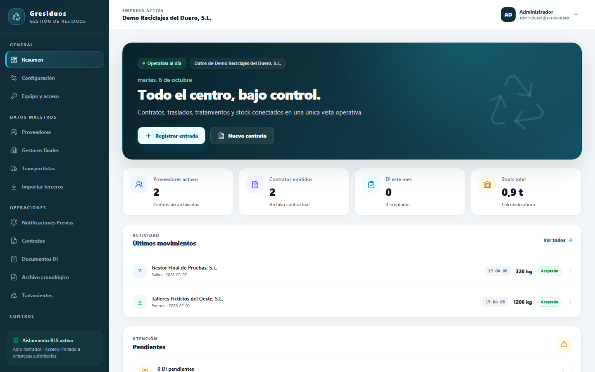

**Documentos de identificación:** emisión con contrato y centro exactos
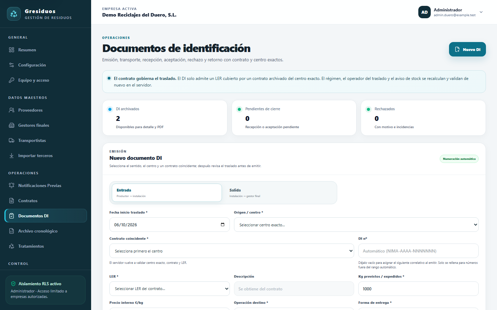

**DI emitido** con su documento
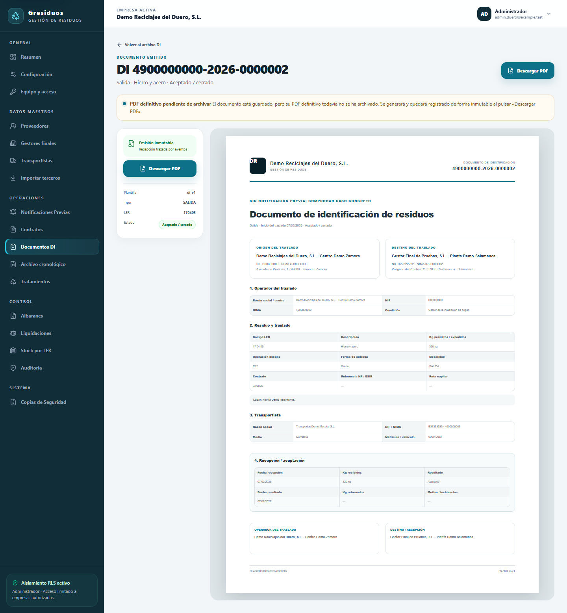

**Contratos de tratamiento multirresiduo**
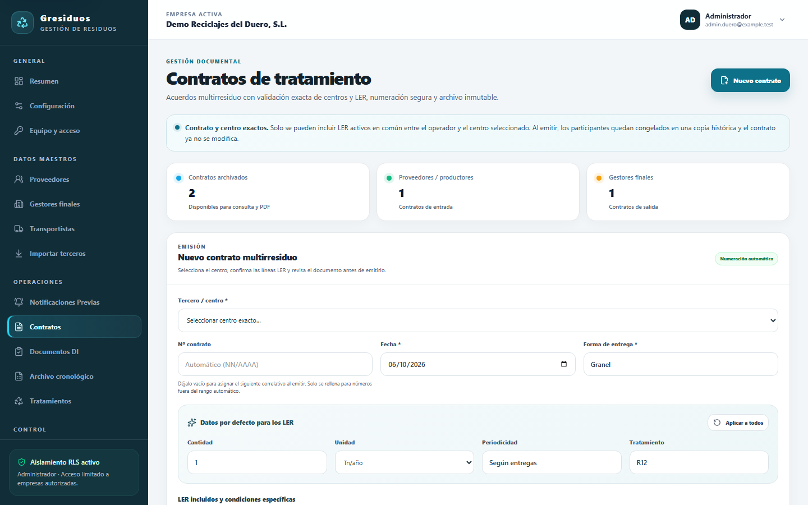

**Contrato emitido, inmutable**
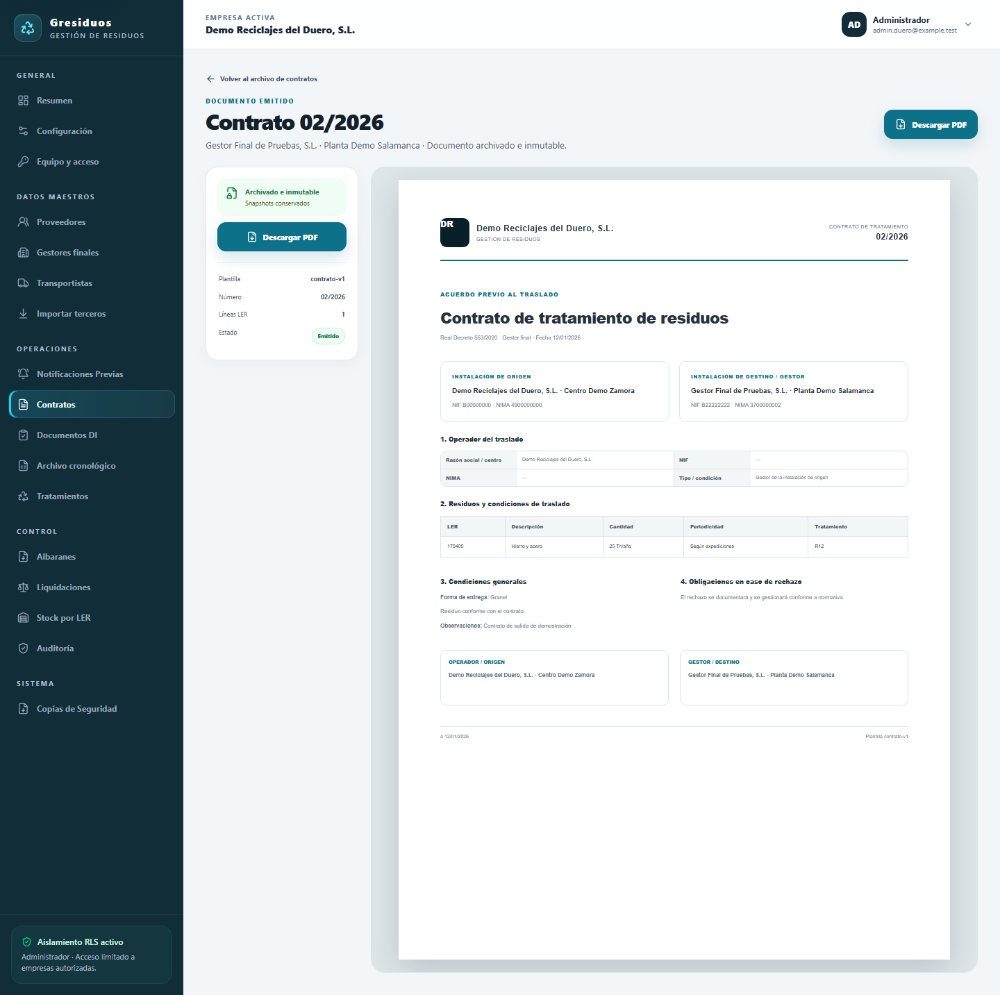

**Archivo cronológico** generado desde los DI
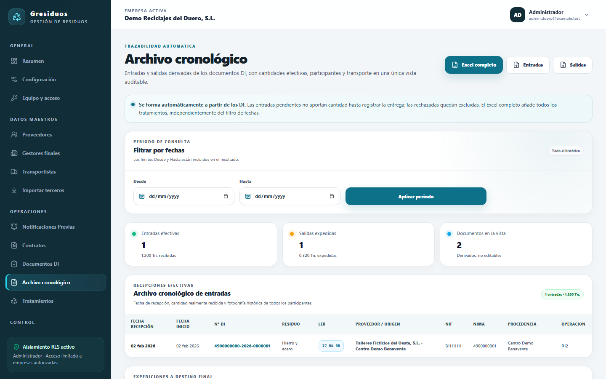

**Stock por LER**
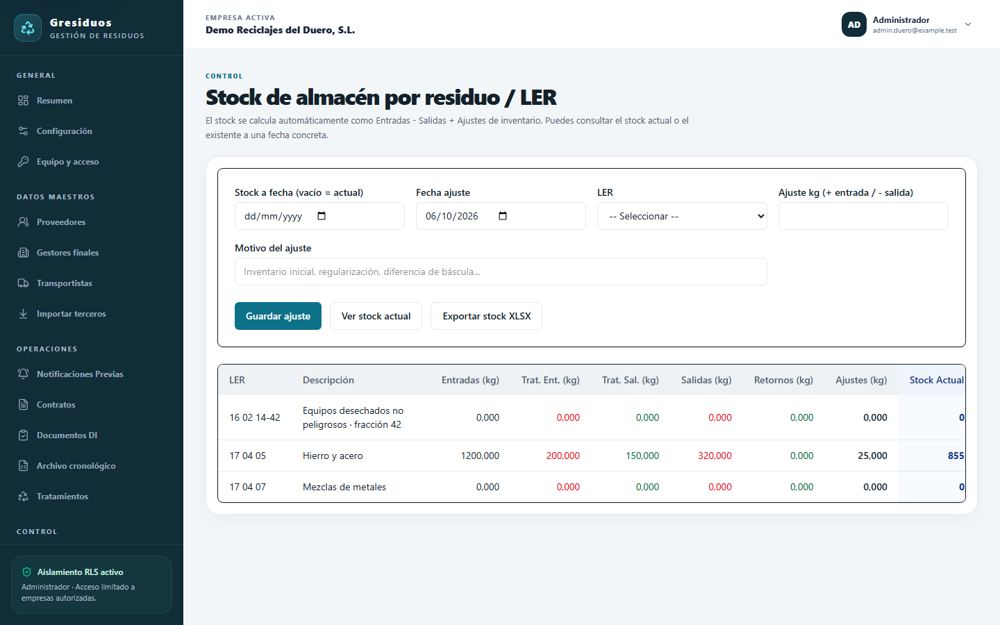

**Tratamientos y balance de masas**
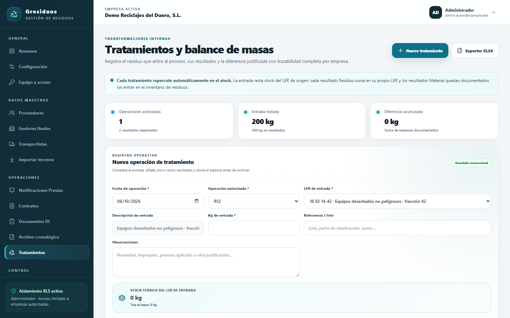

**Albaranes**
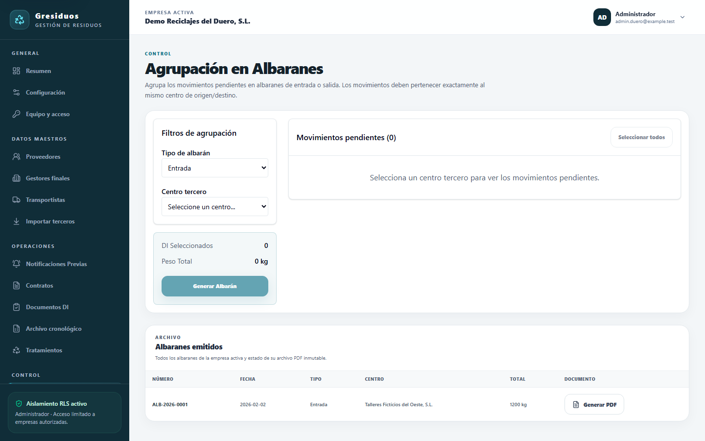

**Liquidaciones (prefacturación no fiscal)**
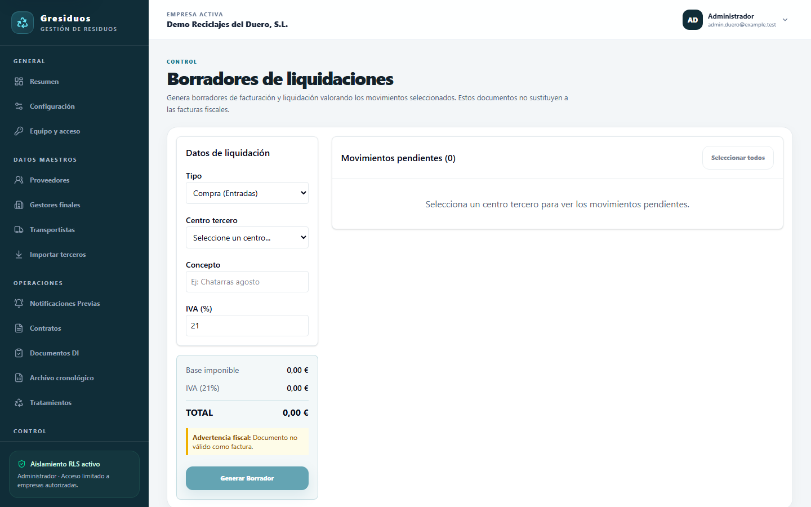

**Auditoría inmutable**
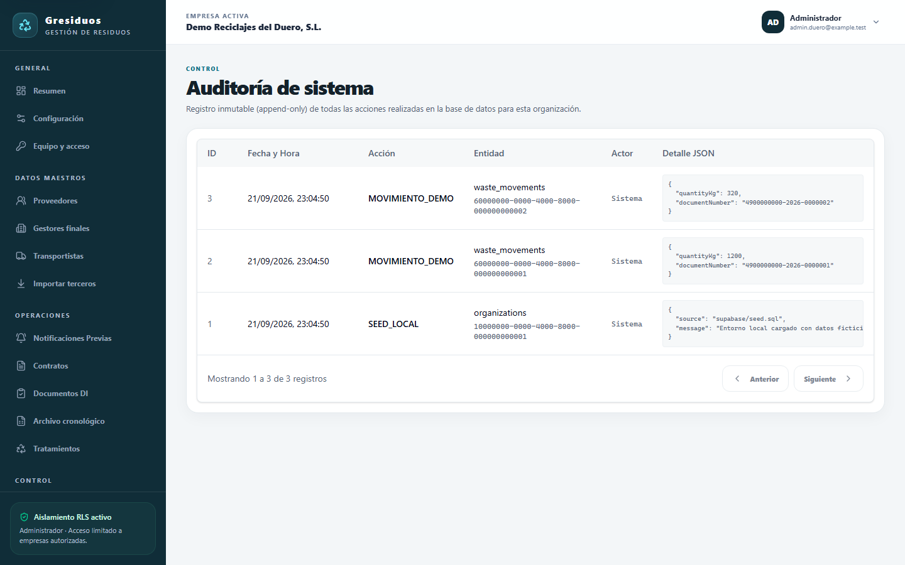

**En el móvil**
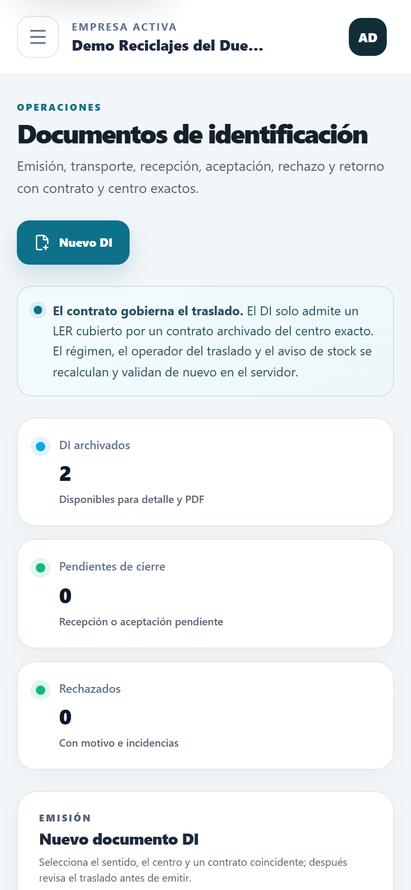
